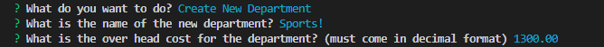

# bamazon_cli
Amazon-like storefront connected to mysql database; made up of three seperate JavaScript files (for Customers, Managers, and Supervisors respectively);

## Bamazon Customer
This file displays all available items and then asks the customer to enter the id and amount of the product they wish to buy.

If the amoutn entered by the user exceeds the amount in stock, the purchase does not succeed, and then user is prompted if they want to attempt another purchase.

On a success the total cost is displayed and the user is prompted 
for if they want to make another pruchase.

A no ends the program.

## Bamazon Manager
This file lets the user select from 5 actions (View all the products for sale, view those products with low inventory (less than 5), add some amount of inventory to a given product, add a new products, or exit the program).

The first action displays all available products.

On any action (except exit), the user is reprompted to select an action.
The second option shows all products with low amounts of stock, and displays the pertinent information to the user (id, name, price, and stock quantity)

The third option allows the user to add an amount to a given item in stock, the item id and amount must be entered.

The fourth options allows the user to add an new product to the database; prompting them to enter a name, department, price and initial quantity.

The last option exits the program.

## Bamazon Supervisor
This program allows a user to view products sales by department, display the aggregate sales and total profits for each department. Only departments with items for sale will display.

It also allows the user to creat a new department asking for a name and the overhead costs of it.

Exit once again, exits the program.

## Dependencies
All three programs depend on the npm mysql and inquirer packages, as well as a file (password.js) which holds the password for the connect mysql database (content is initially an empty string, if you have a password it will need to be added).